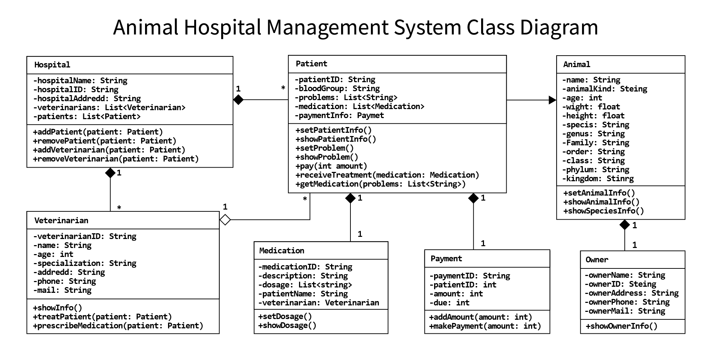

## Animal Hospital Management System
- **Object Oriented & Design Pattern Lab**
- **[Ahnaf Shahrear Khan](https://github.com/ahnafshahrear)**
- **Computer Science & Engineering, University of Rajshahi**
- **Code:** `CSE4122`

### Language
- **Java**

### Class Diagram

### Description
- **This is a simple Animal Hospital Management System using Object Oriented Concept in Java. We can manage the information of patients & veterinarians through this. We can also assign the patient to a veterinarian, manage their medication information & animal's owner information. We can also manage payment through this. The description of the classes is given below**

| **Class**        |                                                                                          **Description**                                                                                         |
|:------------------:|------------------------------------------------------------------------------------------------------------------------------------------------------------------------------------------------|
| **Hospital**     | **This class contains the information of the Hospital & works as the main class. We can add patients & doctors from the class. We can manage various functions of patients & doctors from here.** |
| **Animal**       | **This class contains some basic information about an animal.**                                                                                                                                     |
| **Patient**      | **This class contains basic information of patient's including owner, payment & medication. This class also performs functions related to patients.**                                              |
| **Owner**        | **This class contains information about the owner.**                                                                                                                                                |
| **Veterinarian** | **This class contains information of veterinarian's & perform related functions.**                                                                                                               |
| **Medication**   | **This class contains information on medication.**                                                                                                                                               |
| **Payment**      | **This class manages payments**                                                                                                                                                                  |

### Sample Output
- **To see a demo output  [`click here`](https://github.com/ahnafshahrear/Animal-Hospital-Management-System/blob/main/Output.txt)**
